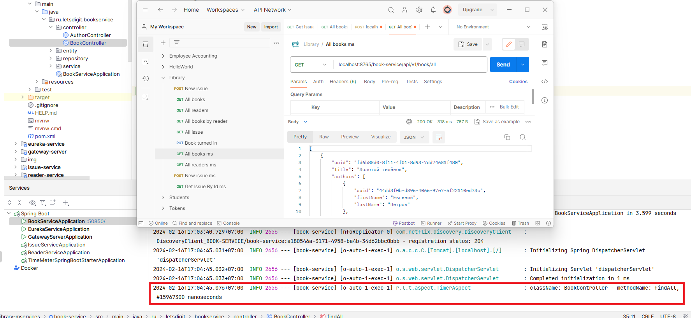
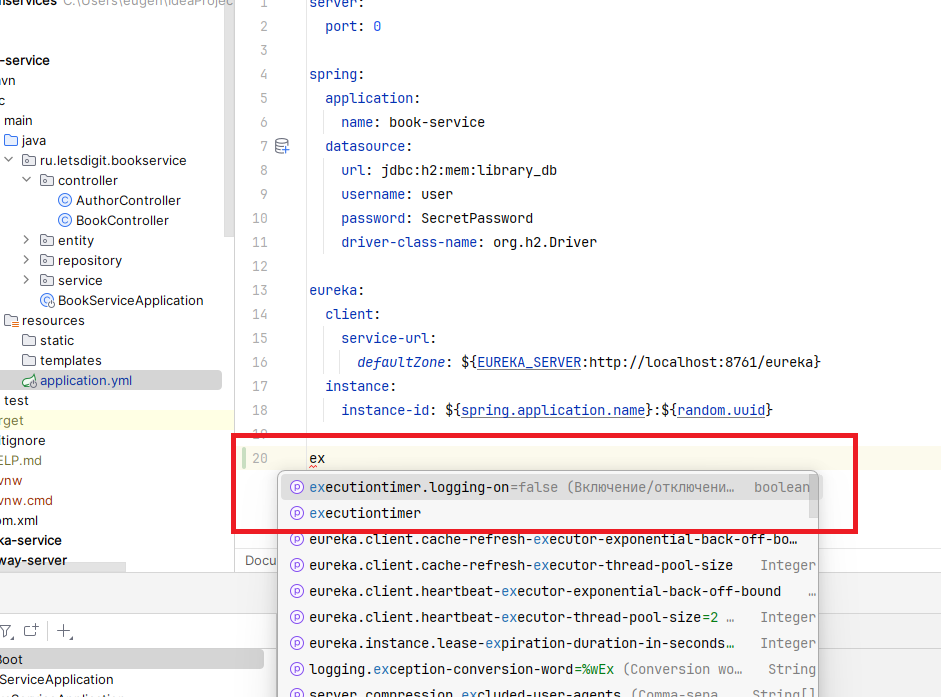
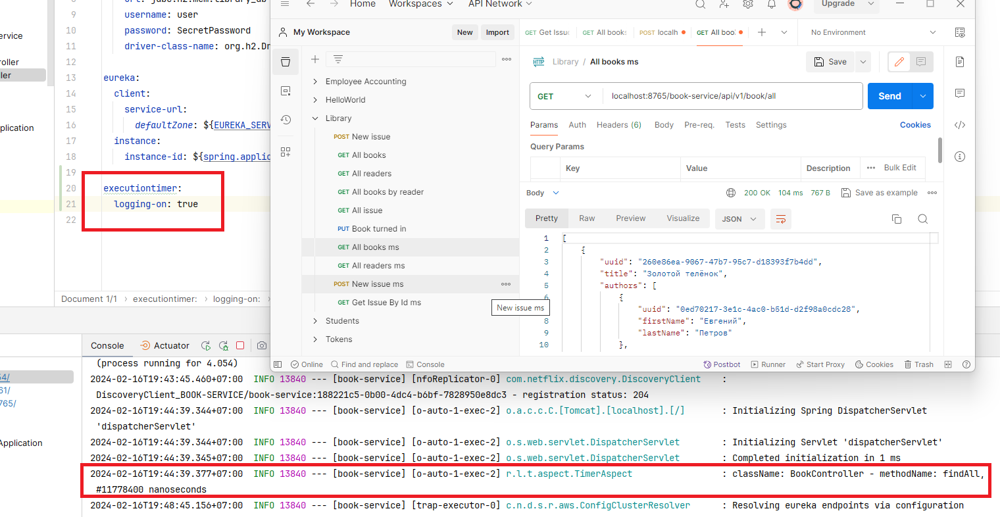
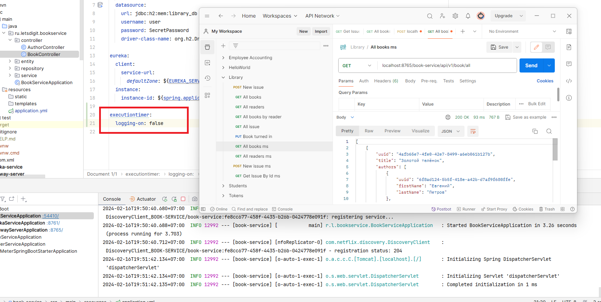

# Creating Your Own Starter

## Задача

Проблематика: имеется несколько микросервисов (проектов) на spring-boot: reader-service, book-service, issue-service, ...
Хочется, чтобы в каждом из этих проектов работал аспект-таймер, замеряющий время выполнения метода бина, помеченного аннотацией @Timer (см. дз к уроку 8)

Решение: создать стартер, который будет инкапсулировать в себе аспект и его автоматический импорт в подключающий проект.
То есть:
1. Пишем стартер, в котором задекларирован аспект и его работа
2. Подключаем стартер в reader-service, book-service, issue-service, ...

Шаги реализации:
1. Создаем новый модуль в микросервисном проекте - это и будет наш стартер
2. Берем код с ДЗ-8 (класс аспекта и аннотации) и переносим в стартер
3. В стартере декларируем Configuration и внутри нее декларируем бин - аспект
4. В проекте стартера в resources/META-INF/spring/org.springframework.boot.autoconfigure.AutoConfiguration.imports прописываем полный путь конфигурации
5. Подключаем зависимость стартера (pom-dependency) в микросервисы
6. Проверяем, что аспект работает

Доп. задание (со звездочкой): придумать точки расширения\конфигурирования аспекта:
Включить\выключить по флажку в конфиге (ConditionalOnProperty)

## Решение

### Создаем новый модуль

Создаем новый модуль `time-meter-spring-boot-starter` с зависимостями:

`pom.xml`
```xml
...

<dependency>
    <groupId>org.springframework.boot</groupId>
    <artifactId>spring-boot-starter</artifactId>
</dependency>
<dependency>
    <groupId>org.springframework.boot</groupId>
    <artifactId>spring-boot-autoconfigure-processor</artifactId>
</dependency>

...
```

### Создаем @Configuration класс

`TimeMeterConfiguration.java`
```java
@AutoConfiguration
public class TimeMeterConfiguration {

    @Bean
    public TimerAspect timer() {
        return new TimerAspect();
    }
}
```

### Locating Auto-configuration Candidates

В папке resources создаем 
`./META-INF/spring/org.springframework.boot.autoconfigure.AutoConfiguration.imports`

Файл org.springframework.boot.autoconfigure.AutoConfiguration.imports должен содержать 
список классов конфигурации:

`org.springframework.boot.autoconfigure.AutoConfiguration.imports`:
```
ru.letsdigit.timemeterspringbootstarter.TimeMeterConfiguration
```

### Подключаем стартер

book-service `pom.xml`:
```xml
...

<dependency>
    <groupId>ru.letsdigit</groupId>
    <artifactId>time-meter-spring-boot-starter</artifactId>
    <version>0.0.1-SNAPSHOT</version>
</dependency>

...
```

Отмечаем метод контроллера аннотацией `@Timer`:
```java
@Timer
@GetMapping(value = "/all")
public ResponseEntity<Iterable<Book>> findAll() {
    return new ResponseEntity<>(service.findAll(), HttpStatus.OK);
}
```

При запросе на http://localhost:8765/book-service/api/v1/book/all в 
логах отображается работа TimerAspect:



## Дополнительная функциональность

Для реализации возможности включения/выключения логирования из `application` файла
сервиса создаем property-класс с описанием параметров.
`TimeMeterProperties.java`
```java
@Data
@ConfigurationProperties("executiontimer")
public class TimeMeterProperties {
    /**
     * Включение/отключение логирования
     */
    private boolean loggingOn = false;
}
```
Редактируем класс конфигурации
`TimeMeterConfiguration.java`
```java
@AutoConfiguration
@EnableConfigurationProperties(TimeMeterProperties.class)
@ConditionalOnProperty(value = "executiontimer.logging-on", havingValue = "true")
public class TimeMeterConfiguration {

    @Bean
    public TimerAspect timer() {
        return new TimerAspect();
    }
}
```
где 
```java
@ConditionalOnProperty(value = "executiontimer.logging-on", havingValue = "true")
```
условие при котором будет выполняться логирование.

### Автодополнение



### Логирование включено


### Логирование отключено
